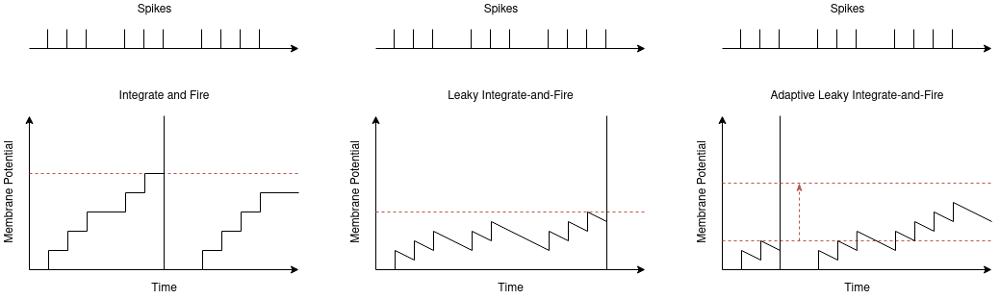
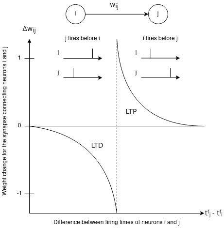

# Motivation

## Spiking Neural Networks
In response to the observed issues with artificial neural networks, researchers have turned to spiking neural networks (SNNs). SNNs are a variant of artificial neural networks that more closely mimic the behavior of natural neural networks. These “third generation” networks receive data in the form of spikes. Each spike corresponds to a specific weight specified by the synapse it travels across. As a neuron receives spikes, its membrane potential approaches a threshold value. When the membrane potential exceeds this threshold value, the neuron emits a spike which gets transmitted to all other neurons connected to it. After firing, the neuron waits for a period of time known as the “refractory period” before its membrane potential can start accumulating again. This operation continues for a distinct span of time.

## ANN vs SNN Execution
To summarize the general idea of SNNs compared to traditional ANNs, there are three main differences to keep in mind. The first is that traditional ANNs perform inference instantaneously, as opposed to SNNs that need to operate over a specified duration of time before an input’s classification can be determined. Second, traditional ANNs use raw numerical values as inputs for the neurons, as opposed to SNNs that use spikes that occur over a specified duration as inputs for the neurons. Finally, the output value for a traditional ANN is determined by passing the sum of the input values multiplied by their respective synapse weights through an activation function such as ReLU or sigmoid. This is compared to an SNN neuron which just adds the weights of the synapses that carried spikes on the current timestep to its membrane potential.

## SNN Advantages
SNNs are believed to have more potential than traditional ANNs in several aspects. First, the energy efficiency of an SNN can outperform that of an ANN depending on the technique used to encode the input data into spikes and the number of neurons that need to produce spikes. This data and computation sparsity thus prevents each neuron from having to perform large computations at each timestep when compared to traditional ANNs.
SNNs also do not inherently feature any large-scale matrix multiplication. Each neuron is only required to add the weight values of the synapses that had spikes to its current membrane potential, and to check if the potential exceeds its threshold value. Because of this, SNN neurons can be realized with only adders and comparators, which combined have a lower area and power consumption than the multipliers and adders required by a traditional ANN implemented in hardware.

The learning algorithms for SNNs may also be more efficient to implement in hardware and require fewer resources than an algorithm such as backpropagation. Furthermore, by having an efficient on-chip learning mechanism, SNNs may be more capable of adapting to faults that occur in hardware by learning around them.

Finally, SNNs may also be more capable of learning patterns in time series and real time problems because of their temporal properties, and their more biologically accurate representation may allow them to better accelerate neuroscience research.
SNNs have three primary components needed for simulation: an encoding scheme, a neural model and a learning technique.

## Encoding Data for SNNs
Many schemes exist for encoding input data into spikes that can be fed into a SNN. Rate coding is one of the most popular encoding schemes which maps an input’s intensity to its corresponding input neuron’s firing rate. The higher the intensity of the input, the more frequently the input neuron will fire a spike.

  

Temporal coding aims to take a more sparse approach at encoding the input data. Each input neuron only fires once: inputs with higher intensities fire earlier than inputs with lower intensities.

  

Population coding is a less popular approach where each input corresponds to several neurons, and the input is encoded by adjusting the times at which each of the input neurons fire.

  

Each encoding scheme has its tradeoffs. A rate coding scheme is very robust to noise that may be transmitted with the input spikes, however, neurons firing at a high rate cause the circuit to be more active and therefore consume more power. Additionally, the SNN will need to be simulated for an adequate amount time to accurately measure the input neuron rates.
A temporal coding scheme uses less energy because spikes are only transmitted once, but it is very susceptible to noise that gets transmitted in place of spikes.
Population coding is more balanced between rate and temporal coding, but it requires more neurons to represent the input data.

## Neural Models for SNNs
Like changing the activation function for a neuron in a standard ANN, the behavior of each neuron can also be adjusted in an SNN with different neural models. The integrate-and-fire, or IF, neuron is the simplest model where the membrane potential is accumulated normally until a threshold value is reached before resetting.
The leaky integrate-and-fire, LIF, model has also been derived as a more biologically accurate model. In an LIF neuron, the membrane potential decrements towards a resting value at each timestep. The longer the neuron goes without receiving an input spike, the closer the membrane potential will get to its resting state.
Lastly, the adaptive LIF model is like the LIF model, with the only exception being that when the neuron emits a spike, the neuron’s threshold value increases to prevent it from quickly firing again. The threshold value will continue to increase each time the neuron fires, and gradually decays towards a resting value when the neuron is not firing.

  

## Learning Techniques for SNNs
The most commonly used learning technique used for SNNs is spike-timing-dependent-plasticity, or STDP. This learning rule operates on the behavior: “neurons that fire together, wire together”. In this technique, if a pre-synaptic neuron fires just before a post-synaptic neuron, the weight between those two neurons is increased. This behavior is called long-term potentiation and the intuition is that the connection between the neurons should be strengthened if the pre-synaptic neuron causes the post-synaptic neuron to spike. Alternatively, if a pre-synaptic neuron fires just after a post-synaptic neuron, the weight between those two neurons is decreased. This behavior is called long-term depression and the intuition is that the connection should be weakened if the pre-synaptic neuron has no relation to the post-synaptic neuron.
Several variations have been added on top of the simple STDP to add more versatility to the learning process. For example in some simple supervised STDP approaches, a teacher signal is used to force the output neuron that corresponds to a designated class to remain in a firing state, while STDP adjusts the weights of the synapses that produced spikes correlating to the teacher signal. Reward modulated STDP is another approach that merges reinforcement learning with STDP to model a biological dopamine response. And finally, biologically inspired backpropagation techniques work to optimize each neurons’ membrane potential function.

  

## Challenges with Implementing SNNs
Though they have extraordinary potential as outlined by their advantages, there are several challenges that are limiting the application of SNNs in machine learning problems.
SNNs primarily suffer because training them is unintuitive. Spike events are non-differentiable, which makes optimizing the cost function of the network challenging. Because efficient ways to train SNNs are still under development, SNNs have not been able to reach the same accuracy level on similar classification tasks performed by ANNs. Even the process of comparing the performance of SNNs and ANNs needs to be studied more since SNNs and ANNs perform differently depending on the format of the dataset provided. The programming frameworks used to model SNNs are also still in their infancy and needed to be more comprehensive to support SNN simulation.
Lastly, there are several parameters of the encoding scheme, neural model and learning technique that can be adjusted when modeling an SNN. More research needs to be conducted to identify the tradeoffs between each of these variations for a variety of different machine learning tasks. The research in this project aims to understand the tradeoffs of these different variations for a simple image classification task which has been shown in several previous works.
